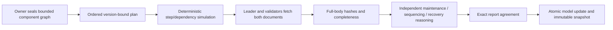
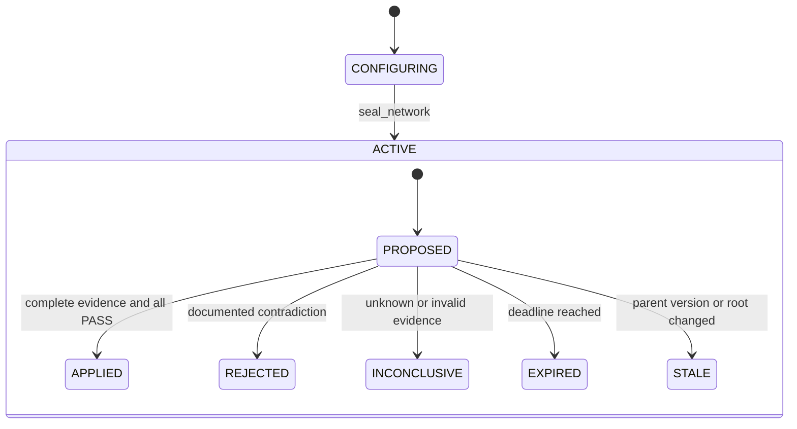

# DynamicInfrastructureOrchestrator

A GenLayer infrastructure **planning model** with ordered maintenance batches,
dependency protection, independently fetched specifications/runbooks, and immutable
versioned snapshots. No certificates, capability consumption, device control, or payments.

## Problem and consensus boundary

A change can preserve a dependency graph and still violate a documented maintenance
restriction. Ordinary deterministic contracts can enforce state edges and references,
but cannot interpret a natural-language isolation or recovery procedure.

The contract owns both layers: deterministic dependency checks at **every ordered step**,
and independent GenLayer interpretation of the actual fetched specification and runbook.
The owner configures the model and selects the documents. These documents are not
independent truth authorities: consensus establishes plan/document compatibility only.



## State machine



Every plan outcome is terminal. Only APPLIED changes the model. Failed consensus
does not fabricate an INCONCLUSIVE record: the transaction fails without mutation;
the proposal remains pending until agreement or expiry. An owner can resolve an
expired plan without web/LLM calls.

## API

- `create_network(network_id, model_url, model_hash, runbook_url, runbook_hash)`
- `register_component(network_id, component_id, state, dependency="")`
- `seal_network(network_id)`
- `propose_transition(network_id, plan_id, parent_version, steps_json, deadline)`
- `apply_transition(network_id, plan_id)`
- `get_network`, `get_plan`, `get_record`, `get_snapshot`

All mutations require the network owner. Configuration is frozen at seal; component
and plan associations are network-scoped. At most 16 components and steps; a component
appears once per plan. Dependencies reference only previously registered components,
preventing cycles. ACTIVE components require an ACTIVE dependency.

## Consensus

Each validator independently fetches **both full response bodies**, computes SHA-256,
checks HTTP 200, exact committed hash, UTF-8 decoding and a 12KB body limit, then derives:

| Criterion | Consequential question |
|---|---|
| maintenance_allowed | Does every step comply with documented component/state restrictions? |
| sequencing_safe | Does the order respect documented isolation and dependency requirements? |
| recovery_defined | Is a concrete applicable recovery procedure documented for each changed component? |

Each value is PASS, FAIL, or UNKNOWN. No confidence score or tolerance exists. Exact
comparison covers context, target graph, URLs, statuses, hashes, match/completeness flags,
and every decision. Document text is untrusted data, not prompt instructions. Explicit
support is required; missing procedures do not become PASS.

Canonical SHA-256 result roots bind the contract address, network, proposal, proposer,
parent root/version, exact steps, deadline, outcome, and complete report. Snapshots chain
to the previous model root and result root.

## Example workflows

The public `examples/` documents are **synthetic fixtures**, not observed equipment.
Cooling supplies a machine. A supported batch isolates the machine to STANDBY, then
moves cooling to MAINTENANCE. Reversing that order reverts deterministically. Moving
the machine directly ACTIVE → MAINTENANCE satisfies the generic state-edge table,
but violates the fetched documents and should be semantically REJECTED.

```json
[{"component":"machine","from":"ACTIVE","to":"STANDBY"},
 {"component":"cooling","from":"ACTIVE","to":"MAINTENANCE"}]
```

Two plans against the same parent may coexist; after one applies, the other becomes
STALE and cannot overwrite the model. A changed evidence body produces INCONCLUSIVE,
even if a caller supplied a well-formed hash or a plausible description.

## Install, test and deploy

```powershell
python -m pip install -r requirements.txt
npm install -g genlayer
genvm-lint check contracts/DynamicInfrastructureOrchestrator.py
pytest tests/direct -v
genlayer network set studionet
genlayer account
genlayer deploy --contract contracts/DynamicInfrastructureOrchestrator.py
```

Use an encrypted deployment keystore. Never commit credentials. StudioNet is an
experimental gasless environment, not production deployment. Direct tests run the
leader path with mocked evidence; they do not prove validator agreement. See
[PROOF_MATRIX.md](PROOF_MATRIX.md) and [LIVE_PROOFS.md](LIVE_PROOFS.md) for real-network
results and explicit test limits. `scripts/demo.ps1` provides interaction commands.

## Verify deployment

Inspect the finalized receipt **execution result**, not just transaction status.
Read `genlayer code ADDRESS` and compare it with the published source (normalize
line endings only). Read plan records and model snapshots. Independently recompute
`SHA256(json.dumps(packet, sort_keys=True, separators=(",", ":")).encode())`.

## Security and limitations

See [SECURITY.md](SECURITY.md) and [docs/threat-model.md](docs/threat-model.md).
Owner control and source selection are explicit trust assumptions. Hash binding proves
byte integrity, not provenance, currentness, or physical reality. The deadline limits
plan use, not document age. Documents and model can be wrong. LLM prompt injection and
model diversity remain risks; exact disagreement blocks mutation but reduces liveness.
No availability, field safety, service delivery, or execution guarantee is asserted.
